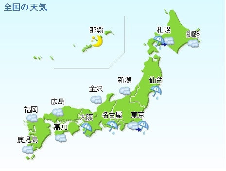

# Japan Weather Streaming Project



## Table of Contents
1. [Overview](#overview)
2. [Technical Structure](#technical-structure)
3. [Prerequisites](#prerequisites)
4. [Deployment Guide](#deployment-guide)
   - [Local Environment Setup](#local-environment-setup)
   - [Cloud Deployment with Terraform](#cloud-deployment-with-terraform)
5. [Dashboard Visualization](#dashboard-visualization)


## Overview

This project is designed to create a robust, scalable, real-time weather data analytics pipeline using the [Open-Meteo API](https://open-meteo.com/en/features/). The focus is on extracting weather forecasts for the ten most renowned cities in Japan, including Tokyo, Osaka, Kyoto, Sapporo, Nagoya, Hiroshima, Fukuoka, Yokohama, Kobe, and Sendai. The core functionality of this pipeline lies in its ability to provide continuous, streaming data integration and processing, enabling stakeholders to make informed decisions based on up-to-the-minute weather data.

### Objective
The main objective of the project is to build a **real-time data ingestion** to provide continuous and real-time weather updates that can assist in immediate decision-making for sectors reliant on weather conditions, such as transportation and logistics.

### Potential Use Cases
- **Event Planning:** Event organizers can use the dashboard to make last-minute changes to schedules and venues based on real-time weather forecasts.
- **Agricultural Sector:** Farmers and agricultural businesses can utilize the forecast data to plan agricultural activities and protect crops from adverse weather conditions.
- **Tourism Industry:** Tourism operators can better manage tourist expectations and experiences through timely weather updates, enhancing visitor satisfaction and safety.


## Technical Structure

The project is architected to showcase a modern data engineering stack, comprising:

- **Apache Airflow** orchestrates and schedules the workflow.
- **Apache Kafka** manages the streaming data pipeline, ensuring robust data handling and processing.
- **Apache Spark** processes large datasets quickly and efficiently.
- **PostgreSQL** and **PgAdmin** provide robust database management and visualization.
- **Google BigQuery** offers a powerful platform for big data analytics.
- **dbt (Data Build Tool)** transforms data within the data warehouse, preparing it for analysis.
- A custom-built **API Producer** service is configured to pull data from the Open-Meteo API.
- **Docker** containerizes all components, ensuring that they are isolated, portable, and scalable.

Integration with GCP’s BigQuery and Cloud Storage demonstrates the project’s cloud-native approach, enabling scalable data storage and sophisticated analytics.

## Prerequisites

Before deploying the project, the following prerequisites are necessary:

- Docker and Docker Compose: For running the containerized environment.
- A GCP account: To access Google Cloud services such as BigQuery and Cloud Storage.
- Terraform: For automating the deployment of cloud resources.
- Familiarity with CLI operations: As the deployment and interaction with the project are largely conducted through the command line.
- An API key from Open-Meteo is **not required** for the free version used in this project. The free version allows up to 10,000 requests per day for non-commercial use. For more details and usage conditions, refer to the [Open-Meteo Terms and Conditions](https://open-meteo.com/en/terms).

## Deployment Guide

### Local Environment Setup

Setting up the data engineering environment locally involves several key steps to ensure all components are correctly configured and deployed. Follow these steps to set up the project on your local machine:

1. **Clone the Repository**: Start by cloning this repository. Once cloned, navigate into the `repository` directory which contains the Docker configuration files and service definitions.

    ```sh
    git clone <repository-url>
    cd <repository-name>
    ```

2. **Environment Variables**: Create a `.env` file in the `services` directory. Use the `example.env` file as a guide to understand which environment variables need to be set. Update the values according to your environment and GCP configuration.

    ```sh
    cp example.env .env
    # Then edit the .env file with your specific configurations
    ```

3. **GCP Service Account**: Place your GCP service account JSON file in the `keys` directory. If you prefer to use a different directory, make sure to update the path accordingly in the `.env` file. This file is crucial for enabling interactions with GCP services.

    ```sh
    mkdir -p keys
    # Copy your GCP service account JSON file to the keys directory
    cp path/to/your/service-account-file.json keys/
    ```

4. **Processor Architecture**: Before running `docker-compose`, you need to specify the processor architecture in the `dbt.Dockerfile`. You can find this setting on line 6 of the file. Adjust this line to match the architecture of your local system's CPU.

    ```dockerfile
    # Example adjustment for an AMD64 architecture
    # Top level build args
    ARG build_for=linux/amd64
    ```

    ```dockerfile
    # Example adjustment for an ARM architecture
    # Top level build args
    ARG build_for=linux/arm64
    ```

5. **Deploy Stack with Docker Compose**: With the initial configuration completed, deploy the stack using the following command:

    ```sh
    docker-compose up -d --build
    ```

6. **Monitor Deployment**: After executing the `docker-compose` command, use your favorite monitoring tool to verify that the stack has deployed correctly. For example, you can use Portainer's dashboard to monitor the services. 

    

    To install Portainer, follow the instructions at: [Portainer Installation Documentation](https://docs.portainer.io/start/install-ce/server/docker).

7. **Access Airflow**: Once the stack is running, open a web browser and navigate to `http://localhost:8080` to access the Airflow web interface. Here you should see the DAGs already running.

    

8. **Execute DAGs**: Dags are configured to start immediately the stack is up, and configured to run once a day.

9. **Troubleshooting DBT DAG**: If you encounter issues with the DAG that runs DBT tasks, you can execute DBT commands directly using the following `docker-compose` command:

    ```sh
    docker-compose run --rm dbt-bg run --project-dir /usr/app/dbt/weather
    ```

Remember to replace `<repository-url>` and `<repository-name>` with the actual URL and name of your repository, and adjust any file paths as per your project's structure.

### Cloud Deployment with Terraform

Deploying the project in a cloud environment requires a series of steps that involve creating secure access credentials and initializing Terraform configurations. Follow these steps to deploy the project on a cloud instance:

1. **Generate SSH Key**: Generate an SSH key pair to securely connect to the cloud instance. This key will be used to authenticate your connection without the need for passwords. Use the following command and ensure to use a email associated with the cloud account:

    ```sh
    ssh-keygen -t rsa -b 2048 -C "your-email@example.com"
    # Follow the prompts to specify the file in which to save the key
    ```

2. **Terraform Configuration**: Create a `terraform.tfvars` file by copying the provided example. This file will contain your cloud environment's specific configuration values, such as the project ID, region, and credentials.

    ```sh
    cp terraform.tfvars_example terraform.tfvars
    # Edit the terraform.tfvars file with your cloud configurations
    ```

3. **Deploy Environment**: With the Terraform variables set, apply your Terraform plan to deploy your cloud resources. This step will create the necessary infrastructure for your data engineering stack, including compute instances, storage, and networking components.

    ```sh
    terraform init
    terraform apply
    # Confirm the action when prompted by Terraform
    ```

4. **SSH Connection**: After your environment is deployed, connect to your cloud instance via SSH to finalize the setup. Use the IP address or hostname provided by your cloud provider along with the path to your private SSH key.

    ```sh
    ssh -i path/to/your/private-key user@host
    # Make sure to replace path/to/your/private-key and user@host with your actual key path and instance details
    ```

5. **Docker Stack Deployment**: Once connected to the instance, follow the same steps detailed in the [Local Environment](#local-environment) setup to deploy the Docker stack, you will see that repository is already cloned and account service json file copied to `/home/<user>/.gcp` folder.

## Dashboard Visualization

The culmination of the data pipeline is a dynamic dashboard providing intuitive visualizations of weather in important cities in Japan. 

This dashboard presents a clear and comprehensive visualization of weather data for various cities in Japan over the course of a month. The upper section displays two main graphs: on the left, a line graph depicting the daily maximum and minimum temperatures, clearly showing temperature trends and variability over time. On the right, there is a bar chart showing accumulated precipitation per day, allowing viewers to quickly gauge the amount of rainfall and identify any patterns or anomalies.


For a deeper dive into the insights each visualization offers, or to explore the live dashboard, please refer to [this link](https://lookerstudio.google.com/reporting/d023db4b-2f9e-4339-bc4d-fa0065291e13).
